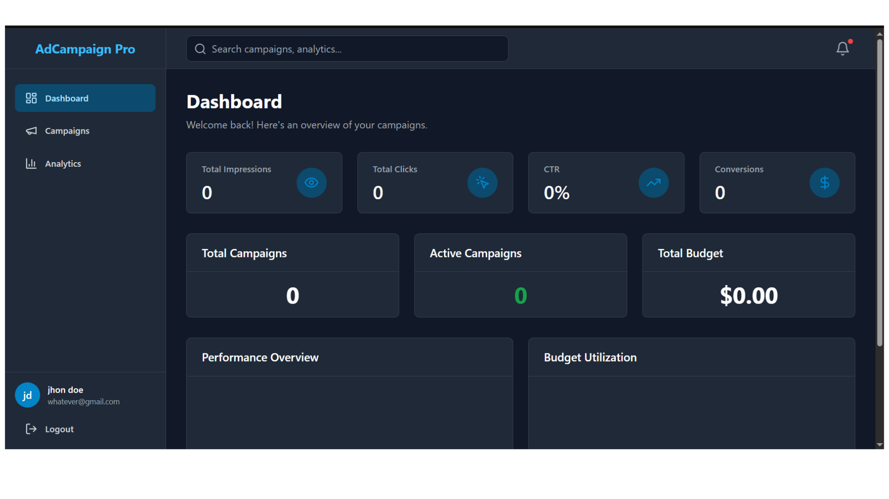
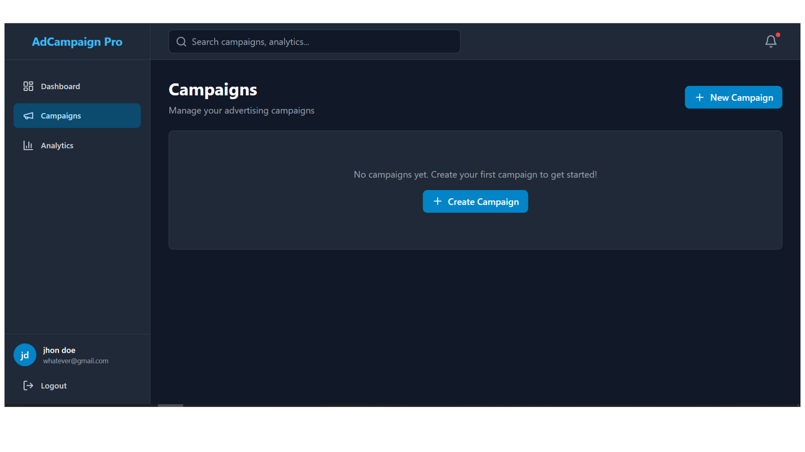

# 🚀 Ad Campaign Management Platform - Frontend

> A modern, full-stack demo application showcasing professional web development skills with Next.js, React, TypeScript, and modern cloud deployment practices.

**Live Demo**: [View Demo](https://ads-platform-frontend-psi.vercel.app/login) | **Backend**: [Render Deployment](https://ads-platform-backend-9eej.onrender.com)

## 📖 About This Project

This is a **portfolio/demonstration project** built to showcase full-stack development capabilities, featuring a complete ad campaign management system with authentication, CRUD operations, analytics dashboards, and modern UI/UX practices. The project demonstrates proficiency in building production-ready applications with industry-standard tools and best practices.




## ✨ Key Features

- 🔐 **Secure Authentication** - JWT-based authentication with automatic token refresh
- 📊 **Campaign Management** - Complete CRUD operations for ad campaigns
- 📈 **Analytics Dashboard** - Interactive charts and real-time metrics with Recharts
- 🎨 **Modern UI/UX** - Responsive design with Tailwind CSS and custom components
- ⚡ **Performance Optimized** - Next.js 14 App Router with server-side rendering
- 🛡️ **Type Safety** - Full TypeScript implementation across the codebase
- ✅ **Form Validation** - React Hook Form with Zod schema validation
- 🌐 **API Integration** - Axios with interceptors and error handling
- 📱 **Mobile Responsive** - Mobile-first design approach
- ☁️ **Cloud Deployed** - Frontend on Vercel, Backend on Render

## 🛠️ Tech Stack

### Frontend
- **Framework**: Next.js 14 (App Router)
- **Language**: TypeScript 5.3
- **UI Library**: React 18
- **Styling**: Tailwind CSS
- **HTTP Client**: Axios
- **Form Management**: React Hook Form
- **Validation**: Zod
- **Charts**: Recharts
- **Icons**: Lucide React
- **Date Handling**: date-fns
- **Build Tool**: Next.js built-in bundler

### Backend Integration
- **API**: RESTful API hosted on Render
- **Authentication**: JWT tokens with refresh mechanism
- **Storage**: localStorage for client-side state

### Development Tools
- ESLint for code quality
- TypeScript for type safety
- Git for version control

### Deployment & Infrastructure
- **Frontend Hosting**: Vercel (recommended)
- **Backend API**: Render
- **Environment Management**: .env files
- **CI/CD**: Automatic deployments via Git integration

## 📋 Prerequisites

- **Node.js**: v18.x or higher
- **npm**: v9.x or higher (or yarn/pnpm)

## � Quick Start

### Installation

1. **Clone the repository**
   ```bash
   git clone <your-repo-url>
   cd ads-platform-frontend
   ```

2. **Install dependencies**
   ```bash
   npm install
   ```

3. **Configure environment variables**
   ```bash
   cp .env.local.example .env.local
   ```
   
   Edit `.env.local`:
   ```env
   NEXT_PUBLIC_API_URL=https://ads-platform-backend-9eej.onrender.com/api
   ```

4. **Start the development server**
   ```bash
   npm run dev
   ```

5. **Open your browser**
   
   Navigate to [http://localhost:3000](http://localhost:3000)

### Build for Production

```bash
npm run build
npm start
```

The optimized production build will be available at `http://localhost:3000`.

## ☁️ Deployment

### Vercel (Recommended)

The easiest way to deploy this Next.js application:

1. **Connect to Vercel**
   - Sign up at [vercel.com](https://vercel.com)
   - Import your Git repository
   - Vercel will auto-detect Next.js configuration

2. **Set Environment Variables**
   
   In Vercel Dashboard → Settings → Environment Variables:
   ```
   NEXT_PUBLIC_API_URL=https://ads-platform-backend-9eej.onrender.com/api
   ```

3. **Deploy**
   - Push to main branch for automatic deployment
   - Or use Vercel CLI: `vercel --prod`

### Docker Deployment

```bash
# Build the Docker image
docker build -t ads-platform-frontend .

# Run the container
docker run -d -p 3000:3000 \
  -e NEXT_PUBLIC_API_URL=https://ads-platform-backend-9eej.onrender.com/api \
  --name ads-frontend \
  ads-platform-frontend
```

## 🌍 Environment Variables

| Variable | Description | Example | Required |
|----------|-------------|---------|----------|
| `NEXT_PUBLIC_API_URL` | Backend API base URL | `https://ads-platform-backend-9eej.onrender.com/api` | Yes |

> **Note**: All client-side environment variables in Next.js must be prefixed with `NEXT_PUBLIC_`.

## 📁 Project Structure

```
ads-platform-frontend/
├── src/
│   ├── app/                    # Next.js App Router
│   │   ├── (auth)/            # Authentication pages
│   │   │   ├── login/         # Login page
│   │   │   └── register/      # Registration page
│   │   ├── (dashboard)/       # Protected dashboard routes
│   │   │   ├── dashboard/     # Main dashboard
│   │   │   ├── campaigns/     # Campaign management
│   │   │   └── analytics/     # Analytics views
│   │   ├── layout.tsx         # Root layout with providers
│   │   ├── page.tsx           # Landing page
│   │   └── globals.css        # Global styles
│   ├── components/
│   │   ├── layout/            # Layout components
│   │   │   ├── Navbar.tsx     # Navigation bar
│   │   │   └── Sidebar.tsx    # Dashboard sidebar
│   │   └── ui/                # Reusable UI components
│   │       ├── Button.tsx     # Button component
│   │       ├── Card.tsx       # Card component
│   │       ├── Input.tsx      # Input component
│   │       ├── Table.tsx      # Table component
│   │       └── Badge.tsx      # Badge component
│   ├── lib/                   # Core utilities
│   │   ├── api.ts            # Axios instance & interceptors
│   │   ├── auth.ts           # Authentication helpers
│   │   └── utils.ts          # Utility functions
│   └── types/                 # TypeScript definitions
│       └── index.ts           # Shared types
├── public/                    # Static assets
├── .env.local.example        # Environment variables template
├── next.config.js            # Next.js configuration
├── tailwind.config.js        # Tailwind CSS configuration
├── tsconfig.json             # TypeScript configuration
├── postcss.config.mjs        # PostCSS configuration
├── Dockerfile                # Docker container setup
├── package.json              # Dependencies and scripts
└── README.md                 # This file
```

## 📊 Available Pages

| Route | Description | Access |
|-------|-------------|--------|
| `/` | Landing page with platform overview | Public |
| `/login` | User login | Public |
| `/register` | User registration | Public |
| `/dashboard` | Main dashboard with metrics | Protected |
| `/campaigns` | View all campaigns | Protected |
| `/campaigns/new` | Create new campaign | Protected |
| `/analytics` | Analytics and insights | Protected |

## 🔐 Authentication Flow

1. **Registration** - Users create an account at `/register`
2. **Login** - Users authenticate at `/login`
3. **Token Storage** - JWT tokens stored in localStorage
4. **Auto-Refresh** - Access tokens automatically refreshed
5. **Protected Routes** - Unauthorized users redirected to login
6. **Logout** - Tokens cleared and user logged out

## 🧪 Development

### Available Scripts

| Command | Description |
|---------|-------------|
| `npm run dev` | Start development server on port 3000 |
| `npm run build` | Build optimized production bundle |
| `npm start` | Start production server |
| `npm run lint` | Run ESLint for code quality checks |

### Code Architecture

- **Component-Based**: Modular, reusable React components
- **Type-Safe**: Full TypeScript coverage
- **API Layer**: Centralized API client with interceptors
- **Auth Management**: Secure token handling with refresh logic
- **Form Handling**: Validated forms with React Hook Form + Zod
- **Styling**: Utility-first with Tailwind CSS

## 🎯 Key Technical Implementations

### Axios Interceptors
- Automatic JWT token injection
- Token refresh on 401 responses
- Error handling and logging

### Form Validation
```tsx
// Using React Hook Form + Zod
const schema = z.object({
  email: z.string().email(),
  password: z.string().min(8)
});
```

### Protected Routes
- Route groups with authentication checks
- Automatic redirects for unauthorized access
- Layout-based protection


##  Skills Demonstrated

This project showcases:
- ✅ Modern React patterns (hooks, context, composition)
- ✅ Next.js 14 App Router architecture
- ✅ TypeScript for type safety
- ✅ API integration with authentication
- ✅ Form validation and error handling
- ✅ Responsive UI/UX design
- ✅ State management (localStorage, React state)
- ✅ Protected routes and authorization
- ✅ Production deployment (Vercel)
- ✅ Environment configuration
- ✅ Code organization and best practices

## 🔒 Security

- JWT authentication with token refresh
- HTTPS in production
- XSS protection via React
- Input validation with Zod

---

## 📄 License

This project is licensed under the MIT License - see the [LICENSE](LICENSE) file for details.

**Purpose**: Portfolio/Skills Demonstration  
**Stack**: Next.js • React • TypeScript • Tailwind CSS  
**Deployment**: Vercel (Frontend) • Render (Backend)

*A demonstration project showcasing full-stack development capabilities with modern web technologies.*
